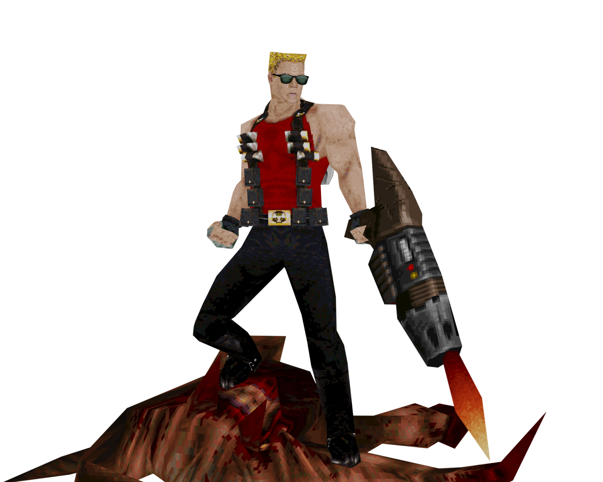

[
]() [Home](home.md#pure-speed-pure-skill-pure-fps) | [Setup](setup.md) | [How To Play](howtoplay.md) | [Impulse Commands](impulse.md) | [Champions](champions.md) | [Advanced Movement](movement.md) | [Weapons](weapons.md) | [Items](items.md) | [Multiplayer](multiplayer.md) | [New Maps](maps.md) | [Custom Maps](custommaps.md) | [Change Log](changelog.md)

# 
CHAMPIONS

[
]()
[Ranger](#ranger) | 
[Death Knight](#death-knight) | 
[Nyx](#nyx) | 
[Doom Slayer](#doom-slayer) | 
[Commander Keen](#commander-keen) | 
[Keel](#keel) | 
[Scalebearer](#scalebearer) | 
[Sorlag](#sorlag) | 
[Slash](#slash) | 
[Anarki](#anarki) | 
[Duke Nukem](#duke-nukem) | 
[Intruder](#intruder) | 
[Big John
](#big-john)

---
## 
Ranger

> **First Appearance : _Quake_**

> **Active Ability : _Dire Orb_**
 Ranger can throw a ball of eldritch energy and teleport to it. Two beings cannot occupy the same space at once; Ranger will be left standing in a pile of the destination's viscera.

> **Passive Ability : _Son of a Gun_**
 Self damage is halved, allowing Ranger to rocket jump and nail jump more than other champions.

[Top](#champions) 

---
## 
Death Knight

> **First Appearance : _Quake_**

> **Active Ability : _Flame Strike_**
 Death Knight swings his sword, unleashing five flying fireballs in a fanning formation. If a fireball is low enough to the ground it will leave a trail of flames in its wake. The flames will set on fire anyone walking through them. The fireballs explode on impact.

> **Passive Ability : _Forged Skin_**
 Death Knight cannot be harmed by fire or lava.

> **Passive Ability : _Charring_**
 When Death Knight strikes an opponent with his sword, he sets that opponent on fire.

[Top](#champions) 

---
## 
Nyx

> **First Appearance : _Quake Champions_**

> **Active Ability : _Ghost Walk_**
 Nyx hops briefly into a parallel dimension, effectively rendering her invisible to her enemies. After 3 seconds Nyx will hop back into the Dreamlands, telefragging any unfortunate souls that happen to be in her re-entry point.
  NOTE: Ghost Walk currently does not allow Nyx to pass through projectiles or players. This is planned to be changed in a future update.

> **Passive Ability : _Wall Jump_**
 Nyx is able to jump while in the air once if she's next to a wall.

[Top](#champions) 

---
## 
Doom Slayer

> **First Appearance : _Doom_**

> **Active Ability : _Berserk_**
 Doom Slayer explodes into a burning rage for 5 seconds, unleashing his fists on any hapless demons and champions who get in his way. Doom Slayer's movement increases and he gains a burst of speed when he punches in the air. His fists deal roughly three times their normal damage.

> **Passive Ability : _Double Jump_**
 Doom Slayer can jump while in the air once, allowing him to slow his fall and disrupt rocket predictions.

[Top](#champions) 

---
## 
Commander Keen

> **First Appearance : _Commander Keen in Invasion of the Vorticons_**

> **Active Ability : _Neural Stunner_**
 Commander Keen's trusty sidearm stuns foes in place, disrupting their ability to evade and attack for 3 seconds. The Neural Stunner can be fired up to 3 times in a row on a full charge; successive shots stack the stun time. Use the opportunity to follow up with a rocket or pogostick combo!

> **Passive Ability : _Pogo Mastery_**
 Commander Keen's melee weapon is a pogo stick he found on Mars; his unsurpassed skill with the device allows him to alter his direction of movement mid-bounce. Holding jump while touching the ground will cause Keen to leap to incredible heights. Landing on an enemy will severely damage them. The pogo stick can be hot swapped to by using the jump input mid-air, while using the attack input will hot swap back to the previous weapon.

> **Passive Ability : _Odd One Out_**
 Being an 8 year old boy, Commander Keen is shorter than the other champions by a significant amount. This can make him harder to hit.

[Top](#champions) 

---
## 
Keel

> **First Appearance : _Quake III Arena_**

> **Active Ability : _Grenade Swarm_**
 Keel is equipped with grenade launchers which operate on a cooldown. When the multi-grenade connects with a target or after 2.5 seconds of bouncing, it explodes into multiple mini-grenades. Each grenade takes 15 seconds to cooldown, and up to 3 grenades can be stored for use.

> **Passive Ability : _Reinforced_**
 Keel has 60% self damage reduction. Splash damage is reduced by 20%; this stacks with the self damage reduction.

> **Passive Ability : _Stockpile_**
 Keel can reduce the cooldown of his ability by 10% by collecting any ammo box.

[Top](#champions) 

---
## 
Scalebearer

> **First Appearance : _Quake Champions_**

> **Active Ability : _Bullrush_**
 Scalebearer leads the way by charging forward with reckless abandon, dealing massive damage to anyone in his path like a rampaging shoggoth to albino penguins. The amount of damage dealt depends on his speed upon impact.

> **Passive Ability : _Acceleration_**
 Scalebearer will gain speed while moving in a straight line.

> **Passive Ability : _Heavyweight_**
 Letting his momentum carry him, Scalebearer brings the hurt simply by running into his enemies.

[Top](#champions) 

---
## 
Sorlag

> **First Appearance : _Quake III Arena_**

> **Active Ability : _Acid Spit_**
 Sorlag spits five blobs of acid at her enemies, burning their flesh and poisoning them with its toxicity. The acid also sticks to surfaces, poisoning anyone who touches it.

> **Passive Ability : _Acid Fiend_**
 Sorlag is immune to the effects of acid and slime.

> **Passive Ability : _Leaping Lizard_**
 Sorlag can alter her direction of movement in the air, allowing her to make sharp turns at high speed. Sorlag also accelerates quickly while moving in the air.

> **Passive Ability : _Amphibious_**
 Sorlag is an excellent swimmer and can breathe underwater.

[Top](#champions) 

---
## 
Slash

> **First Appearance : _Quake III Arena_**

> **Active Ability : _Plasma Trail_**
 Slash leaves a stream of energy behind her. The plasma trail will damage any enemy that touches it, and when the ability button is pressed again, the trail will explode, damaging nearby enemies.

> **Passive Ability : _Crouch Slide_**
 Perform a crouch slide by holding the jump input just as you land on the ground after jumping or falling, vastly increasing Slash's movement speed.

[Top](#champions) 

---
## 
Anarki

> **First Appearance : _Quake III Arena_**

> **Active Ability : _Injection_**
 Anarki instantly heals himself for 50 points and receives a permanent boost to his health. He also receives a speed boost for 5 seconds.

> **Passive Ability : _Air Control_**
 Anarki can change his velocity direction while midair.

> **Passive Ability : _Anti-Gravity_**
 Anarki's hoverboard allows him to fall from any height unscathed.

[Top](#champions) 

---
## 
Duke Nukem

> **First Appearance : _Duke Nukem_**

> **Active Ability : _Devastator_**
 Straight out of the Pentagon's top secret labs comes this double barreled brute of a weapon which lets loose swarms of miniature stinger missiles in the direction of your enemies.

> **Passive Ability : _Jetpack_**
 Duke's government-issue jetpack is one of his greatest tools, whether in mortal conflict against raging aliens or in personal grudge matches in the Arena Eternal. Jump, then press and hold the jump input to fly for a brief period of time. Standing still while activating it will send Duke straight up, while moving in a direction before activation will cause Duke to fly in that direction.

> **Passive Ability : _Duke Talk_**
 Duke will comment on almost everything he does. This can give away your position, but your opponents might be too distracted by the quips to take advantage of this.

[Top](#champions) 

---
## 
Intruder

> **First Appearance : _Dusk_**

> **Active Ability : _Fast Fire Totem_**
 This artifact doubles the Intruder's firing rate with all weapons for roughly 6 seconds.

> **Passive Ability : _Phillie Phanatic_**
 The Intruder can pick up and throw just about any object that isn't nailed down. Different objects may have different effects.

> **Passive Ability : _Return to Sender_**
 The Intruder can use his twin sickles to deflect incoming enemy projectiles, turning their own attacks against them.

> **Passive Ability : _Sturdy Legs_**
 The Intruder does not take fall damage.

> **Passive Ability : _Deep Lungs_**
 The Intruder takes a really really *really* deep breath before diving underwater.

[Top](#champions) 

---
## 
Big John

> **First Appearance : _Dusk_**

> **Active Ability : _Big Barrage_**
 Big John equips his Big Gun and unleashes a full-auto barrage of bullets. He becomes immobile but incoming damage is reduced by 67%. Activating the ability again will put the Big Gun away and the remaining ammunition is subtracted from the cooldown.

> **Passive Ability : _Stockpile_**
 Big John can reduce the cooldown of his ability by 10% by collecting any ammo box.

[Top](#champions) 
---

[
]() [Home](home.md#pure-speed-pure-skill-pure-fps) | [Setup](setup.md) | [How To Play](howtoplay.md) | [Impulse Commands](impulse.md) | [Champions](champions.md) | [Advanced Movement](movement.md) | [Weapons](weapons.md) | [Items](items.md) | [Multiplayer](multiplayer.md) | [New Maps](maps.md) | [Custom Maps](custommaps.md) | [Change Log](changelog.md)

