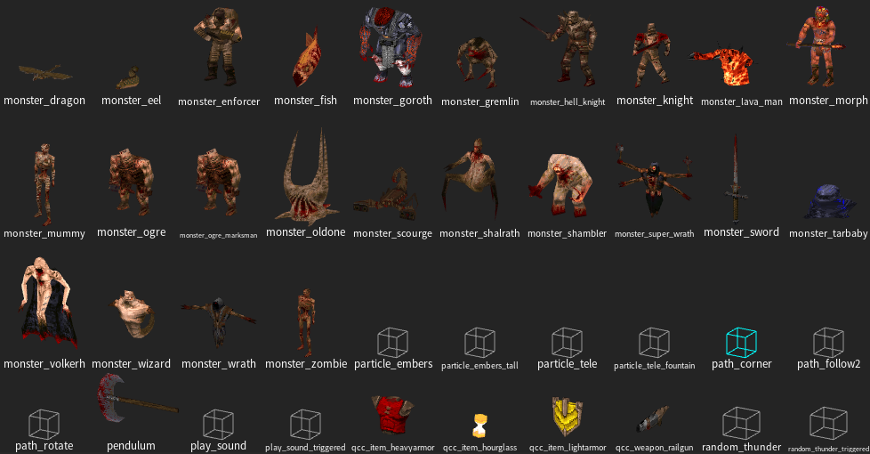

[<p align=center>]() [Home](readme.md#pure-speed-pure-skill-pure-fps) | [Setup](setup.md) | [How To Play](howtoplay.md) | [Impulse Commands](impulse.md) | [Champions](champions.md) | [Advanced Movement](movement.md) | [Weapons](weapons.md) | [Items](items.md) | [Multiplayer](multiplayer.md) | [New Maps](maps.md) | [Custom Maps](custommaps.md) | [Change Log](changelog.md)


# <p align=center>CUSTOM MAPS</p>

Quake Champions Classic should be compatible with any custom maps that are vanilla or mission pack compatible.

If you wish to add a custom map to the in-game map list, you will need to append them to the end of the map list in the "mapdb.json" located in the qcc folder. A template for appending a map to Quake Champions Classic is provided below.
```json
{
    "title": "Custom Map's Name",
    "bsp": "filename_without_extension",
    "episode": "qcc",
    "game": "qcc",
    "dm": true/false,
    "coop": true/false,
    "horde": true/false,
    "bots": true/false,
    "sp": true/false
}
```

### Mapping for Quake Champions Classic
It may be desired to make a map specifically for the mod. Provided in the Quake Champions Classic download are 3 FGD files for use with a mapping tool like TrenchBroom:
- [qcc.fgd](../qcc.fgd)
- [tyrutils_ericw_base.fgd](../tyrutils_ericw_base.fgd)
- [messages.fgd](../messages.fgd)

These FGD files will make all mission pack entities available in your preferred editor. Use them to make it easier to place Quake Champions Classic specific entities. The QCC FGD in particular will be updated any time a feature is added.<br>

<p align=center></p>

If you're interested in working with me (RhapsodyInGeek) to include a map of yours in the official release, feel free to reach out to me on either the [**Quake Mapping Discord**](https://discord.gg/f5Y99aM) or the [**Blue Key Games Discord**](https://discord.com/invite/XAw2a8fQPX).

---


[<p align=center>]() [Home](readme.md#pure-speed-pure-skill-pure-fps) | [Setup](setup.md) | [How To Play](howtoplay.md) | [Impulse Commands](impulse.md) | [Champions](champions.md) | [Advanced Movement](movement.md) | [Weapons](weapons.md) | [Items](items.md) | [Multiplayer](multiplayer.md) | [New Maps](maps.md) | [Custom Maps](custommaps.md) | [Change Log](changelog.md)

