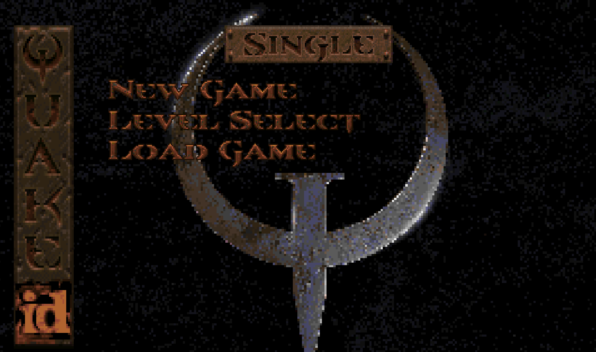
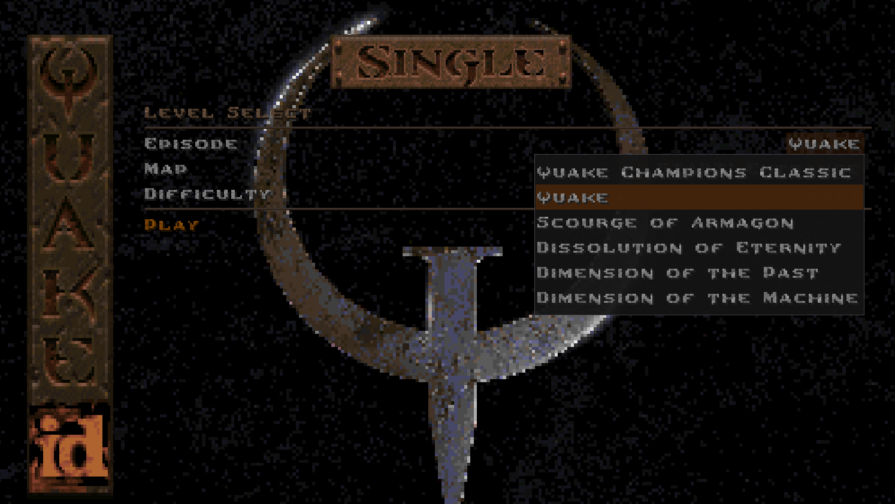
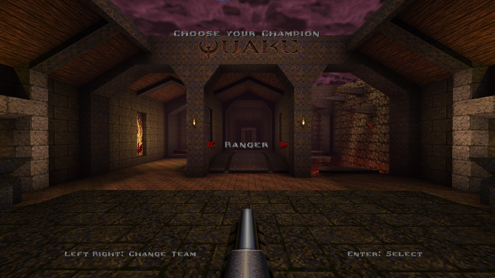
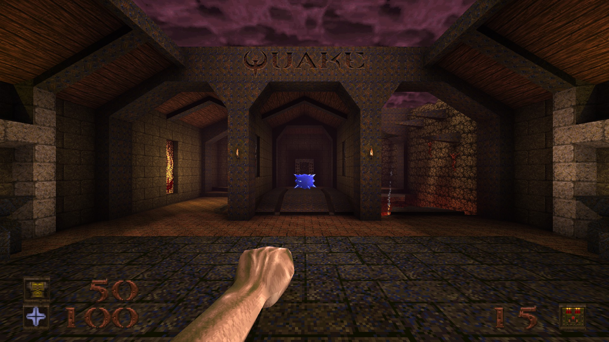
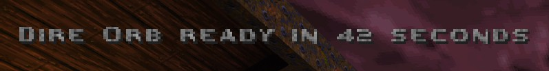
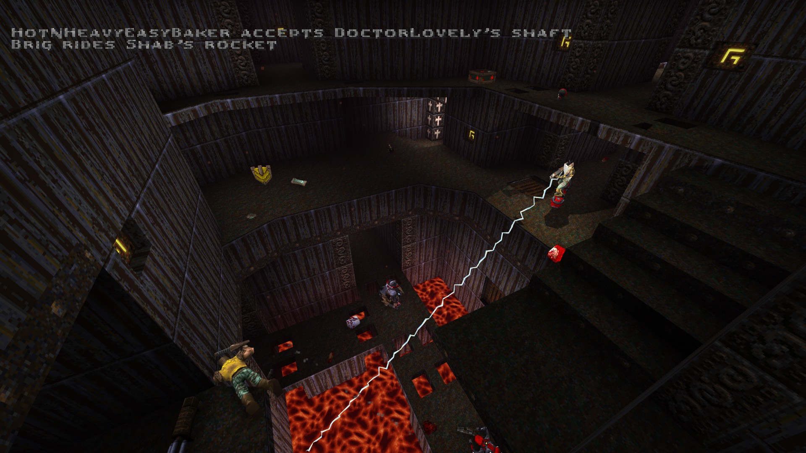
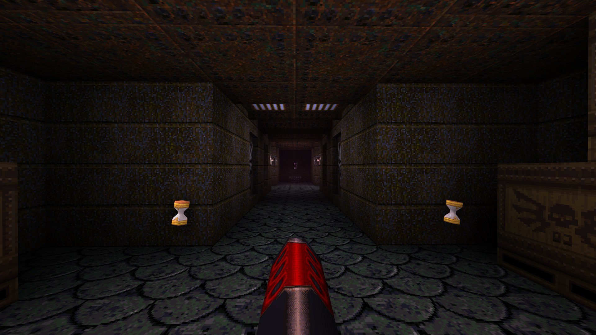
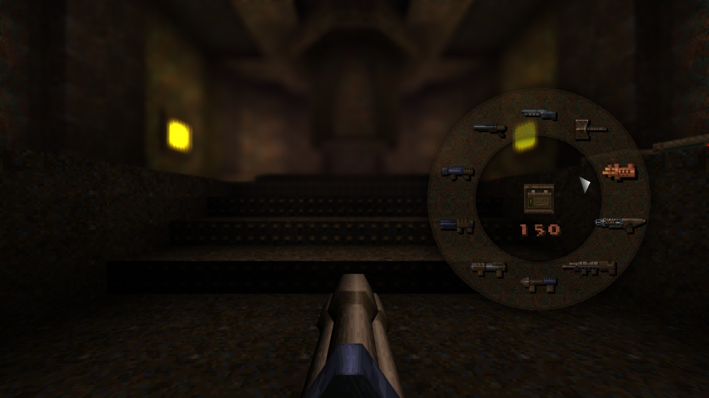
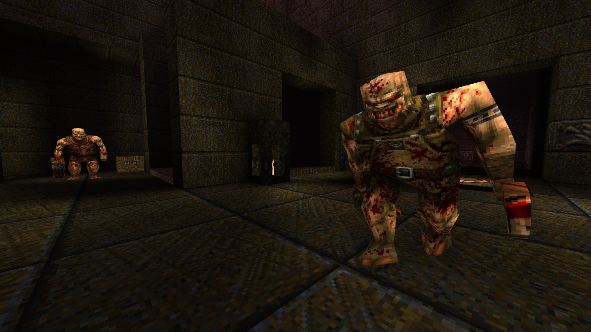
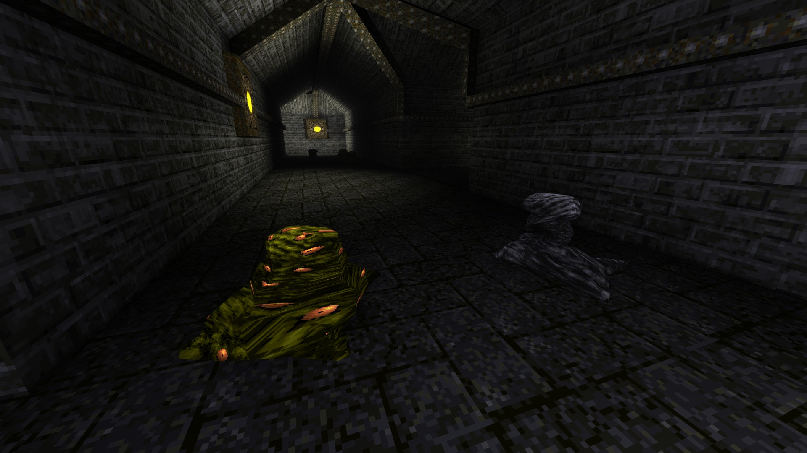

[
]() [Home](home.md#pure-speed-pure-skill-pure-fps) | [Setup](setup.md) | [How To Play](howtoplay.md) | [Impulse Commands](impulse.md) | [Champions](champions.md) | [Advanced Movement](movement.md) | [Weapons](weapons.md) | [Items](items.md) | [Multiplayer](multiplayer.md) | [New Maps](maps.md) | [Custom Maps](custommaps.md) | [Change Log](changelog.md)

# 
HOW TO PLAY

## Single Player

To play the official campaigns, you'll need to select them from the **Level Select** menu. Do ***not*** select the New Game menu, or else you may find the mod deactivated when selecting a Mission Pack Campaign.

Once in the Level Select menu, you'll be able to select the campaign you want to play. Make sure to pick the first real map in your chosen campaign - due to the way Quake works, all campaigns currently use the same Start map.

---
## Champions

_Quake Champions Classic_ offers a variety of different characters to play as, from both the official _Quake Champions_ and all new characters from other significant games in the histories of both id Software and the FPS genre as a whole.

Use [**Impulse 23**](impulse.md#new-impulse-commands) to select a Champion. In the Nightdive Remaster this will bring up a menu prompt.

Other engines do not have this feature and so will just cycle through each Champion one by one. [Each Champion has their own unique impulse](impulse.md#champion-impulses) though, so if you wish you can use one of those commands to quickly swap to your desired Champion.

Champions are divided into 3 different classes: 

| Class | Starting Armor | Maximum Armor | Overstack Armor |
| --- | --- | --- | --- |
| Light | 0 | 75 | 150 |
| Medium | 50 | 100 | 175 |
| Heavy | 100 | 125 | 200 |
 

Light Champions tend to be nimbler than the other classes. Medium Champions more closely reflect normal Quake mobility and survivability. Heavy Champions have not only higher armor values, but their health and armor drains more slowly when overstacked with major items.

## Abilities

For those unfamiliar with Quake Champions, each playable Champion has a unique set of abilities that you can use to gain the edge in the Arena. Abilities are split between _Passive_ and _Active_. These abilities are available in both Single Player and Multiplayer.

**Passive Abilities** require no input to activate and have no cooldown, remaining perpetually available. Passive abilities are often movement variations, immunities to hazards, and other similar indirect effects. A Champion may have one or multiple Passive Abilities.

Each Champion has one **Active Ability**, activated by using [**Impulse 22**](impulse.md#new-impulse-commands). Active abilities have a cooldown associated with them, allowing them to be more direct and powerful than Passive Abilities. The typical cooldown for each ability is 45 seconds. Some abilities, like Commander Keen's Neural Stunner or Athena's Grappling Hook, have shorter cooldowns allowing you to use an ability multiple times before needing to wait for it to recharge.

Active Ability cooldowns can be reduced with the new **Time Shard** items. Non-Quake Champions Classic maps have all of their Rotten Health Kits replaced with Time Shards, so you will see them in the official maps. Time Shards reduce the cooldown by 4.5 seconds. Killing monsters also provides this same effect.

For a full list of Champions and their abilities, consult the [**Champions Chapter**](champions.md) of the docs.

---
## Observer Mode

If you don't wish to participate in a match, or maybe you're officiating a duel, or perhaps just trying to capture some footage for a video, Observer Mode has got your back.

Use [**Impulse 29**](impulse.md#new-impulse-commands) to enter Observer Mode. Your size is reduced significantly, you enter free fly mode, all enemies lose sight of you, and you can no longer interact with the material plane. You do lose all of your current frags above zero, and you are removed from any team you may currently be on.

Your Fire button will warp you between spawn points and intermission camera positions. Your Jump button will cycle you across each player, warping just above them. There isn't currently a chase mode.

To exit Observer Mode, simply use `impulse 29` once again and you will be respawned back into the map.

---
## Mission Pack Support

### Scourge of Armagon
Mjolnir is currently disabled due to the way it hooks into the entity and animation systems. Mjolnir may end up being used as a unique melee weapon for a future Champion as opposed to a standard weapon.

The Proximity Gun and Laser Cannon are supported as in the original mission pack. While not added to the other campaigns, these weapons can still be used in them via the `impulse 9` cheat.

The Proximity Gun can be selected by pressing the Grenade Launcher key twice or by using [**impulse 36**](impulse.md#new-impulse-commands). The Laser Cannon can be selected using the weapon wheel or by using [**impulse 37**](impulse.md#new-impulse-commands).

All of this mission pack's powerups are supported.

### Dissolution of Eternity
The special ammo and weapon types (multirockets, lava nails, etc...) are not included in the mod, and all of their ammo boxes are reverted to the standard ammo types. This was an intentional decision due to the required extra workload on top of their severe balance issues.

Due to how the Multi-Grenade Ogre and Hellspawn enemy variants work, they can now be randomly found throughout the original campaign and the other mission packs.

Some of the spike trap shooters in the original campaign are replaced by Lava Nail traps. It's not a bug, it's a feature.

All of this mission pack's powerups are supported.

### Horde Mode
Support for this game mode now also includes new enemy types and powerups from the first two mission packs. Prepare yourself for a lot more chaos.

---

[
]() [Home](home.md#pure-speed-pure-skill-pure-fps) | [Setup](setup.md) | [How To Play](howtoplay.md) | [Impulse Commands](impulse.md) | [Champions](champions.md) | [Advanced Movement](movement.md) | [Weapons](weapons.md) | [Items](items.md) | [Multiplayer](multiplayer.md) | [New Maps](maps.md) | [Custom Maps](custommaps.md) | [Change Log](changelog.md)
