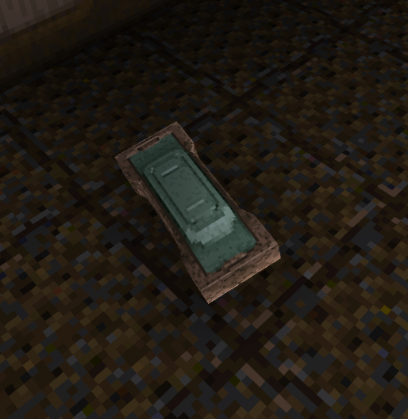
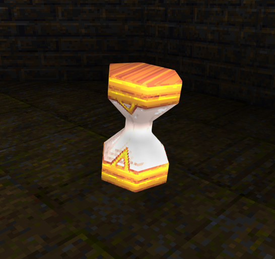
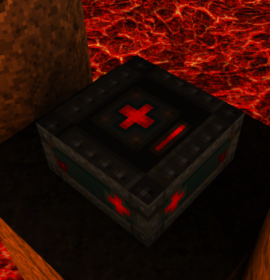
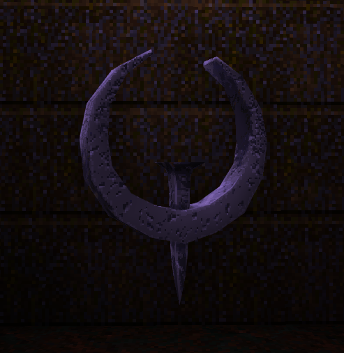
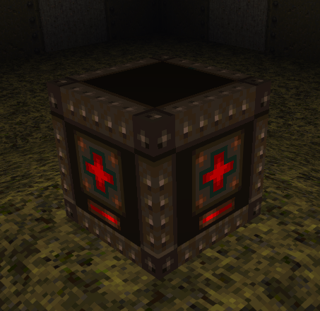
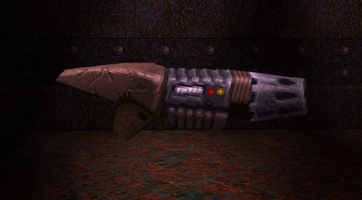

[
]() [Home](home.md#pure-speed-pure-skill-pure-fps) | [Setup](setup.md) | [How To Play](howtoplay.md) | [Impulse Commands](impulse.md) | [Champions](champions.md) | [Advanced Movement](movement.md) | [Weapons](weapons.md) | [Items](items.md) | [Multiplayer](multiplayer.md) | [New Maps](maps.md) | [Custom Maps](custommaps.md) | [Change Log](changelog.md)

# 
ITEMS

[

<a href="#armor-shard">New Items</a> 
[Changed Items](#quad-damage) 
[New Weapons](#railgun) 

---
## 
New Items

Armor has been reworked. There are no longer different classes of armor with different levels of protection. Instead we follow the Quake Champions ruleset.

### Armor Shard
 
Restores 5 points of armor. Can raise armor up to 75 points above maximum. Only drops from other Champions and certain enemies. Disappears after a period of time.

### Light Armor
 
Restores up to 50 points of armor. Replaces all Green and Yellow Armors.

### Heavy Armor
 
Restores 100 points of armor. Can raise armor up to 75 points above maximum. The Heavy Armor now respawns every 30 seconds. Replaces all Red Armors.

### Time Shard
 
Reduces remaining Active Ability cooldown by 4.5 seconds. Replaces all Rotten Health Kits.

### Special Health
 
Restores 25 points of health. Can raise health above maximum, up to 175 total points. Respawns every 15 seconds. Found in Horde Mode and in the map [Crucible](maps.md#crucible).

---
## 
Changed Items

### Powerup
Powerups now take 90 seconds to spawn in Multiplayer, then 120 seconds to respawn.

### Quad Damage
 
Quad Damage will now respawn as a Pentagram after being collected if a certain spawnflag is set.

### Pentagram of Protection
 
The Pentagram no longer grants invincibility. Instead it grants an additional 67% damage reduction. The effect stacks with the damage reduction from armor and abilities. The Pentagram will also now respawn as a Quad Damage after being collected if a certain spawnflag is set.

### Megahealth
 
Still restores 100 points of health, but now can only raise health 75 points above maximum. The Megahealth now respawns every 30 seconds.

---
## 
New Weapon

### Railgun
 
High damage hitscan sniping weapon. In Quake Champions Classic the Railgun uses up 6 cells per shot, for a total of 25 shots.  
All of the base game multiplayer maps now have support for the Railgun, so long as they possess at least 2 Rocket Launchers. If so, one of the Rocket Launchers will be replaced.  
The original campaign now features one Railgun in each Episode.

---

[
]() [Home](home.md#pure-speed-pure-skill-pure-fps) | [Setup](setup.md) | [How To Play](howtoplay.md) | [Impulse Commands](impulse.md) | [Champions](champions.md) | [Advanced Movement](movement.md) | [Weapons](weapons.md) | [Items](items.md) | [Multiplayer](multiplayer.md) | [New Maps](maps.md) | [Custom Maps](custommaps.md) | [Change Log](changelog.md)
