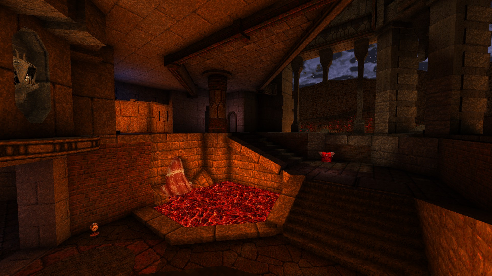

[
]() [Home](home.md#pure-speed-pure-skill-pure-fps) | [Setup](setup.md) | [How To Play](howtoplay.md) | [Impulse Commands](impulse.md) | [Champions](champions.md) | [Advanced Movement](movement.md) | [Weapons](weapons.md) | [Items](items.md) | [Multiplayer](multiplayer.md) | [New Maps](maps.md) | [Custom Maps](custommaps.md) | [Change Log](changelog.md)

# 
NEW MAPS

<b>Dimension of the Doomed</b> 
<a href="#crucible">Crucible</a> 

<b>The Realm of Black Magic</b> 

<b>The Netherworld</b> 

<b>The Elder World</b> 

---

## 
Crucible

_It is when the souls of the damned are tested and forged beneath the endless pool of night in the cauldron of the ebb and flow, which one discovers their true worth: nothing._

><b>Supported Game Modes : </b> Deathmatch, Horde Mode

[Top](#new-maps) 