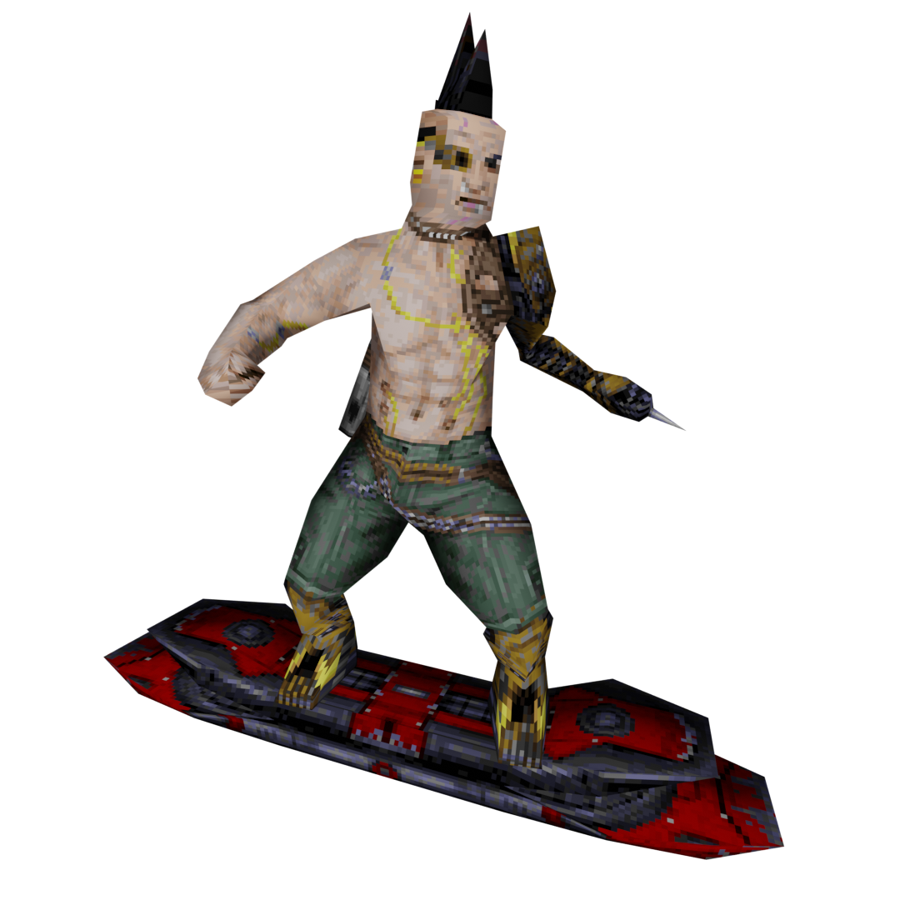
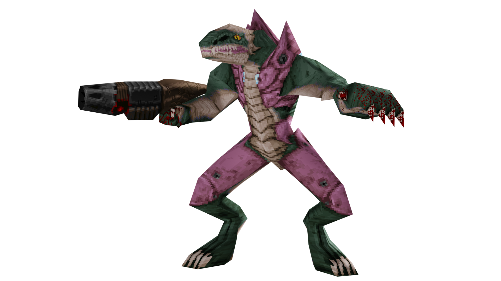

[
]() [Home](readme.md#pure-speed-pure-skill-pure-fps) | [Setup](setup.md) | [How To Play](howtoplay.md) | [Impulse Commands](impulse.md) | [Champions](champions.md) | [Advanced Movement](movement.md) | [Weapons](weapons.md) | [Items](items.md) | [Multiplayer](multiplayer.md) | [New Maps](maps.md) | [Custom Maps](custommaps.md) | [Change Log](changelog.md)

# 
ADVANCED MOVEMENT

Some Champions have special movement mechanics beyond a simple double jump. This chapter will go over the shared movement types available between Champions.

## Air Control

***Champions:*** _Anarki, Commander Keen, Sorlag_

Normally when you jump you can only maintain the directional momentum you had before leaving the ground, but Champions with Air Control have the ability to redirect their movement direction while mid-air. You need only to aim towards the direction you wish to go.

Commander Keen is a special case where his Air Control is only active while using his Pogo Stick. When the Pogo Stick is unequipped he will revert to standard Quake movement.

[Top](#advanced-movement)

## Crouch Slide

***Champions:*** _Slash, Strogg & Peeker, V1_

Due to the limitations of Quake C programming for most source ports and the Nightdive Remaster, Crouch Sliding works a little differently than in _Quake 4_ and _Quake Champions_.

To activate Crouch Slide, first Jump into the air; then, just as you're about to land, press and hold the Jump input. Keeping it held will put you into the Crouch Slide state, greatly increasing your movement speed and lowering your hitbox. Normally this Crouch Slide state will last for roughly 1 second.

As Slash, your Crouch Slide state timer will increase along with your speed boost the longer you are in the air without holding the Jump input, to a maximum of 6 seconds.

Unlike the official games it was featured in, your Crouch Slide movement does take your view angle into account just as it would in normal movement.

[Top](#advanced-movement)

## Nail Jump

[With the changes made to the Nailguns](weapons.md#nailgun--super-nailgun), it is now possible to "nail jump". The boost is nowhere near as powerful as the Rocket Launcher, but also not as damaging. You may find it more useful than a rocket jump in certain scenarios.

---
[
]() [Home](readme.md#pure-speed-pure-skill-pure-fps) | [Setup](setup.md) | [How To Play](howtoplay.md) | [Impulse Commands](impulse.md) | [Champions](champions.md) | [Advanced Movement](movement.md) | [Weapons](weapons.md) | [Items](items.md) | [Multiplayer](multiplayer.md) | [New Maps](maps.md) | [Custom Maps](custommaps.md) | [Change Log](changelog.md)