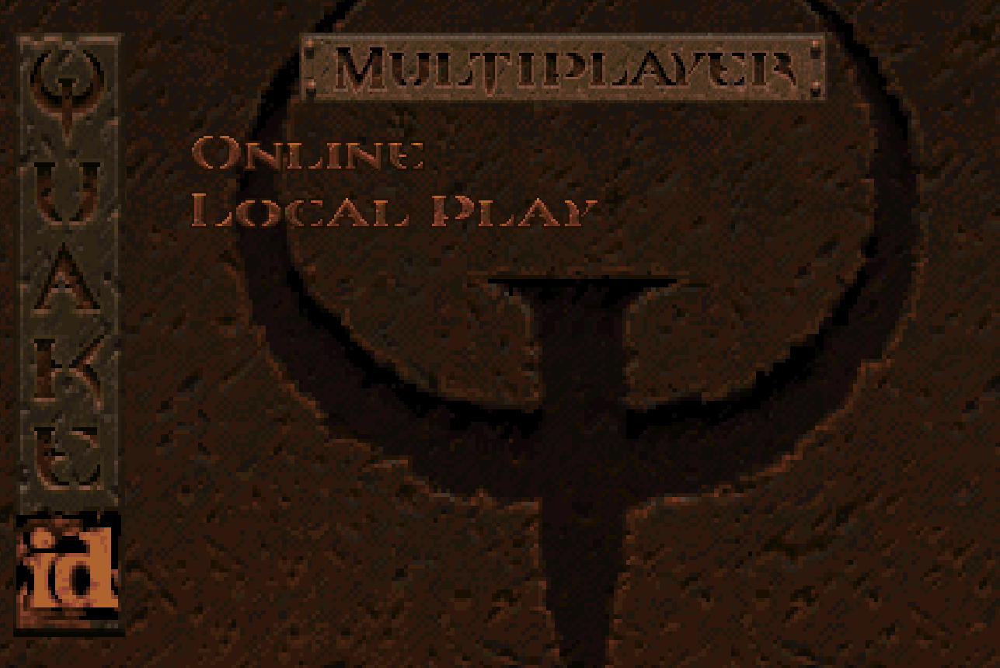
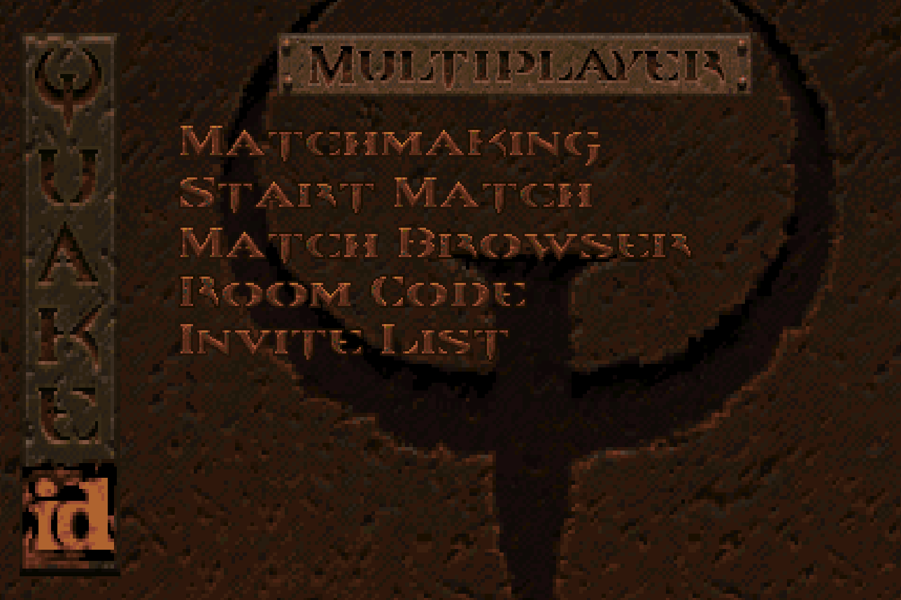
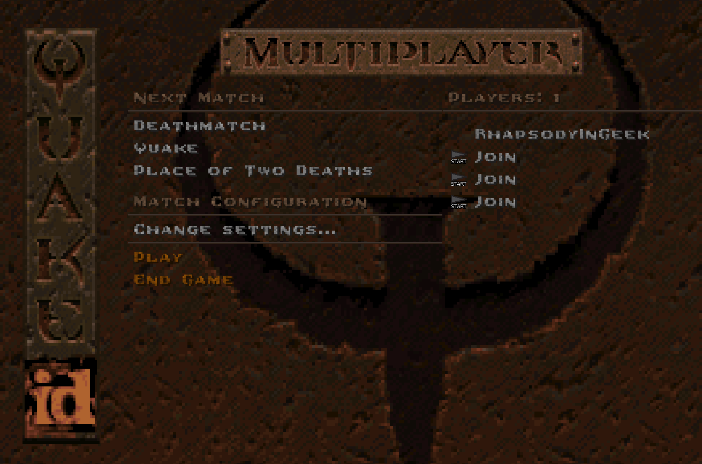
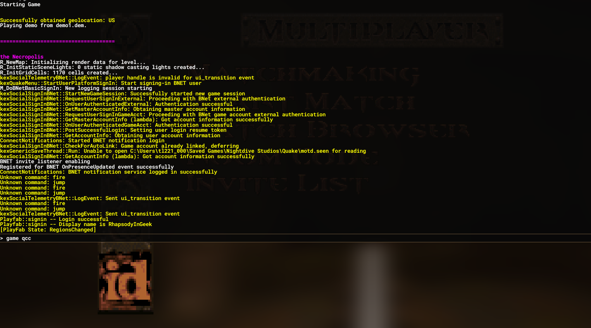
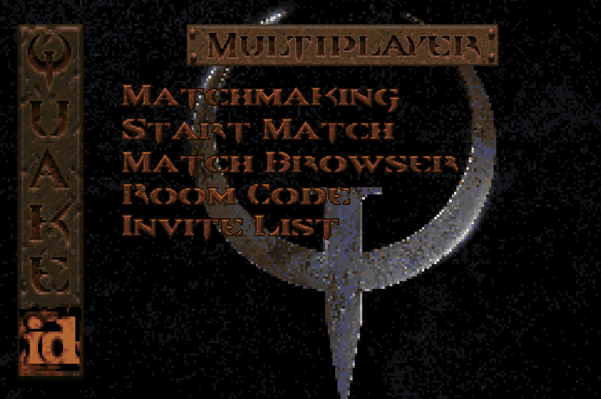
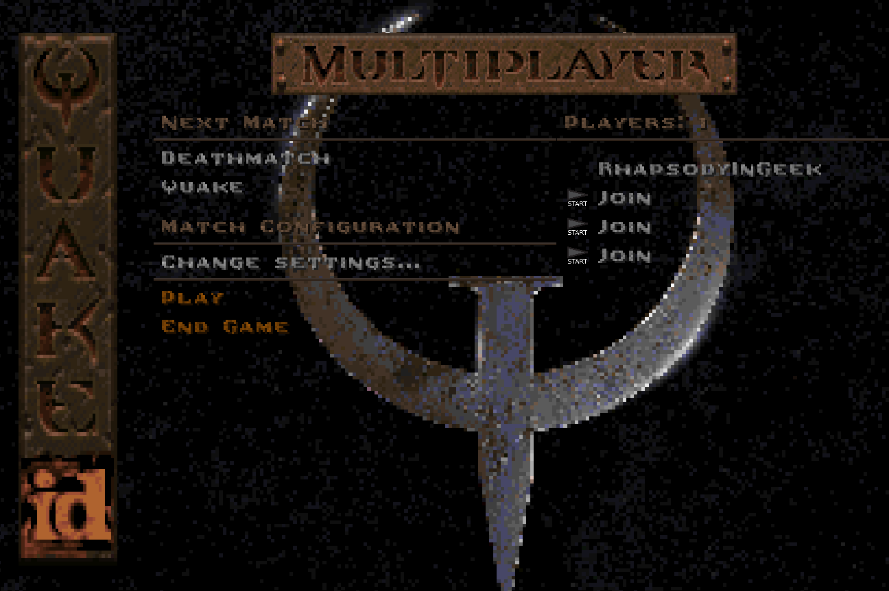
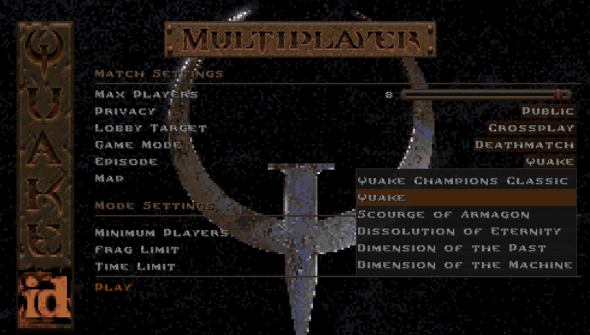

[
]() [Home](home.md#pure-speed-pure-skill-pure-fps) | [Setup](setup.md) | [How To Play](howtoplay.md) | [Impulse Commands](impulse.md) | [Champions](champions.md) | [Advanced Movement](movement.md) | [Weapons](weapons.md) | [Items](items.md) | [Multiplayer](multiplayer.md) | [New Maps](maps.md) | [Custom Maps](custommaps.md) | [Change Log](changelog.md)

# 
MULTIPLAYER

To play multiplayer with the **Nightdive Remaster**, you'll need to follow the following steps:

## HOST

Enter the **Multiplayer** menu. If you currently have a mod active, it will be deactivated and you'll revert to the base game.

Pick either **Online** or **Local Play**. Once you are in either menu...

 

... open the Console and enter the command `game qcc`.

If all goes well your screen should look like this:

 

You should be all set to change your server settings and start the match! 

_NOTE: To select a map, you'll need to choose the appropriate episode. Don't worry! This will not deactivate the mod thanks to the_ `mapdb.json` _configuration._

## CLIENT
To join a server running _Quake Champions Classic_ in the Nightdive Remaster, you need only to have the mod correctly installed. Joining any server will automatically activate the mod. 

For other engines, follow their instructions. It is typically enough to activate the mod with the console command `game qcc` and then host / join a game as normal.

---

[
]() [Home](home.md#pure-speed-pure-skill-pure-fps) | [Setup](setup.md) | [How To Play](howtoplay.md) | [Impulse Commands](impulse.md) | [Champions](champions.md) | [Advanced Movement](movement.md) | [Weapons](weapons.md) | [Items](items.md) | [Multiplayer](multiplayer.md) | [New Maps](maps.md) | [Custom Maps](custommaps.md) | [Change Log](changelog.md)
