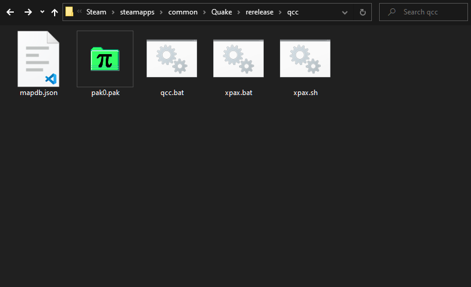
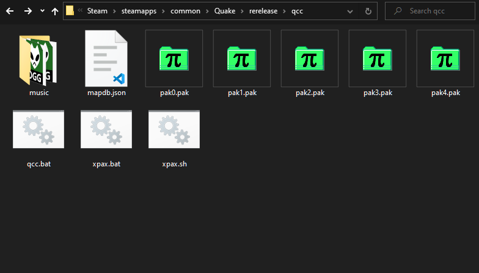
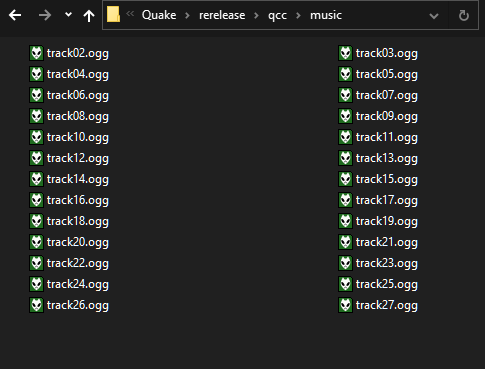

[
]() [Home](readme.md#pure-speed-pure-skill-pure-fps) | [Setup](setup.md) | [How To Play](howtoplay.md) | [Impulse Commands](impulse.md) | [Champions](champions.md) | [Advanced Movement](movement.md) | [Weapons](weapons.md) | [Items](items.md) | [Multiplayer](multiplayer.md) | [New Maps](maps.md) | [Custom Maps](custommaps.md) | [Change Log](changelog.md)

# 
SETUP

## Requirements

To play _Quake Champions Classic_, you will need to own a copy of _Quake 1_ and the official Mission Packs, _Scourge of Armagon_, _Dissolution of Eternity_, _Dimension of the Past_, and _Dimension of the Machine_.

The mod is designed with Nightdive Remaster compatibility in mind, but is also tested on the Ironwail source port. The mod _should_ be mostly engine agnostic, as it is designed completely in Quake C with conditional checks in place for Remaster exclusive features.

## Installation

For the 2021 Rerelease, extract the mod folder inside the `../Steam/steamapps/common/Quake/rerelease/` folder. For all other engines, follow their mod installation instructions (typically copy the mod folder to the Quake root folder). 

Once extracted, run ***xpax.bat*** to automatically copy the data from the addons into the mod folder. For Linux users, ***xpax.sh*** is provided thanks to a community member contribution. The Mission Packs should be installed in their default locations (eg: `Quake Install Path\hipnotic\`). Once the batch file is run, the QCC folder should contain multiple pak files and a music folder. 

If for some reason you are unable to run either the batch or shell script and must perform the setup manually, you'll need to rename `pak0.pak` to `pak4.pak`, then copy and rename the following pak files:

| Origin | Rename |
| --- | --- |
| hipnotic/pak0.pak | pak0.pak |
| rogue/pak0.pak | pak1.pak |
| dopa/pak0.pak | pak2.pak |
| mg1/pak0.pak | pak3.pak |

Once the files are copied and renamed, your QCC folder should look like this: 

If you were able to run the batch file or shell script, the music folder will have automatically copied and renamed all of the tracks. If you need to do this manually, the soundtrack order is _Quake_ (`id1`), _Scourge of Armagon_ (`hipnotic`), and _Dissolution of Eternity_ (`rogue`). 

_NOTE: The music is not a hard requirement of the mod, and only serves to enhance the experience!_

Once you're finished setting up you should be able to run _Quake_ and use the console command `game qcc` to start playing the mod!

## Additional Setup

It is highly recommended to bind the new impulses added with the mod. Please read the [**Impulses chapter**](impulse.md) to learn more.

---

[
]() [Home](readme.md#pure-speed-pure-skill-pure-fps) | [Setup](setup.md) | [How To Play](howtoplay.md) | [Impulse Commands](impulse.md) | [Champions](champions.md) | [Advanced Movement](movement.md) | [Weapons](weapons.md) | [Items](items.md) | [Multiplayer](multiplayer.md) | [New Maps](maps.md) | [Custom Maps](custommaps.md) | [Change Log](changelog.md)
