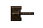
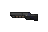
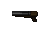
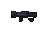
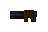
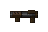
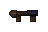
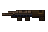
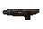

[
]() [Home](readme.md#pure-speed-pure-skill-pure-fps) | [Setup](setup.md) | [How To Play](howtoplay.md) | [Impulse Commands](impulse.md) | [Champions](champions.md) | [Advanced Movement](movement.md) | [Weapons](weapons.md) | [Items](items.md) | [Multiplayer](multiplayer.md) | [New Maps](maps.md) | [Custom Maps](custommaps.md) | [Change Log](changelog.md)

---

# 
WEAPONS

All weapons have had some serious rebalancing to put them more in line with the balance in the official _Quake Champions_. Weapon firing rates are the same as vanilla Quake 1, except where otherwise specified.

### MELEE
 
No longer only an axe, many Champions now wield a unique melee weapon that is all their own. Most however will use the familiar Gauntlet from _Quake III Arena_. The differences are purely cosmetic in most cases.

| Old Damage | New Damage |
| --- | --- |
| 20 | 70 |
 

### SHOTGUN / SUPER SHOTGUN
 
Both shotguns have gotten a significant boost in their damage output, now being extremely useful in close range. While you can still technically snipe with them, the lower ammo limits do encourage you to get up close and personal with them instead.

| Weapon |Old Damage | New Damage | Old Ammo Limit | New Ammo Limit |
| --- | --- | --- | --- | --- |
| Shotgun | 24 (6 pellets) | 40 (10 pellets) | 100 | 25 |
| Super Shotgun | 56 (14 pellets) | 120 (30 pellets) | | |
 

### NAILGUN / SUPER NAILGUN
 
Nails now deal radius damage, making them more dangerous not only for your enemies but also for you. More enterprising players can attempt to nail jump with the new change. The radius damage may seem high but due to the way Quake measures radius distance the actual damage inflicted ends up being a little lower than direct damage.

| Weapon |Old Damage | New Damage | Radius Damage | Old Ammo Limit | New Ammo Limit |
| --- | --- | --- | --- | --- | --- |
| Nailgun | 9 | 12 | 20 | 200 | 150 |
| Super Shotgun | 18 | 18 | 37 | | |
 

### GRENADE LAUNCHER / ROCKET LAUNCHER
 
Grenades will now deal direct damage in addition to splash damage, operating nearly identically to Rockets. Rockets no longer add a random amount of damage to direct hits.

| Weapon |Old Direct Damage | New Direct Damage | Radius Damage | Old Ammo Limit | New Ammo Limit |
| --- | --- | --- | --- | --- | --- |
| Grenade Launcher | 0 | 100 | 120 | 100 | 25 |
| Rocket Launcher | 100 + rand*20 | 100 | 120 | | |
 

### LIGHTNING GUN
 
The lightning beam bug has been fixed, so the LG will now fire only in the direction you aim. Sorry, speedrunners, but there are plenty of other ways to break the game in this mod! The Lightning Gun is no longer the power house of the cell, but it still remains a valuable part of Champion's arsenal.

| Weapon |Old Damage | New Damage | Old Ammo Limit | New Ammo Limit |
| --- | --- | --- | --- | --- |
| Shotgun | 30 per bolt | 13 per bolt | 100 | 150 |
 

### RAILGUN
 
A new weapon added by the mod, the Railgun operates similarly to the one in _Quake Champions_. The Railgun will spawn in each episode of the original campaign, as well as all of the original multiplayer maps. In the event that a map has no Railgun and more than one Rocket Launcher, the second Rocket Launcher will turn into a Railgun.

| Weapon | Damage | Ammo Type | Ammo Cost | Cooldown |
| --- | --- | --- | --- | --- |
| Railgun | 90 | Cells | 6 | 1.5 seconds |
 

---

[
]() [Home](readme.md#pure-speed-pure-skill-pure-fps) | [Setup](setup.md) | [How To Play](howtoplay.md) | [Impulse Commands](impulse.md) | [Champions](champions.md) | [Advanced Movement](movement.md) | [Weapons](weapons.md) | [Items](items.md) | [Multiplayer](multiplayer.md) | [New Maps](maps.md) | [Custom Maps](custommaps.md) | [Change Log](changelog.md)
